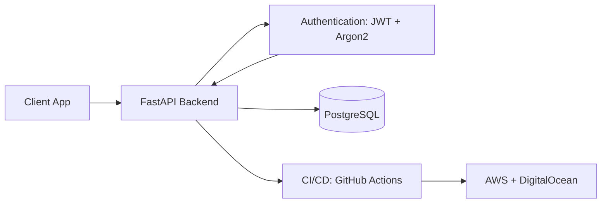

# 🚀 Social Media REST API (Twitter-Style)

A **production-grade social media backend** built with **FastAPI**, **PostgreSQL**, **SQLAlchemy**, **Alembic**, and **JWT authentication** secured with **Argon2**.

It allows users to **sign up, post tweets, like/unlike posts, and view paginated feeds** — fully tested, containerized, CI/CD-enabled, and deployable to the cloud.

---

## 🔥 Key Features

| Feature | Description |
|--------|-------------|
| 👤 **Authentication** | Secure JWT access/refresh tokens, password hashing via **Argon2** |
| 📝 **Posts & Feeds** | Create posts, like/unlike posts, personalized timelines |
| 📄 **Pagination** | Efficient paginated feeds for scalable performance |
| 🗄 **Database** | **PostgreSQL** with SQLAlchemy ORM and Alembic migrations |
| 🧪 **Testing** | Comprehensive **PyTest** coverage with fixtures and mocks |
| 🐳 **DevOps Ready** | Fully containerized using **Docker** & `.env` config |
| 🚀 **CI/CD** | Automated build, test & deploy pipeline via **GitHub Actions** |
| ☁ **Deployment** | Cloud-ready deployment on **AWS EC2 / DigitalOcean** |

---

## 🛠 Tech Stack

**Backend:** FastAPI, Python  
**Auth & Security:** JWT, Argon2, OAuth2  
**Database:** PostgreSQL, SQLAlchemy, Alembic  
**DevOps:** Docker, GitHub Actions, Makefile  
**Cloud:** AWS EC2 / DigitalOcean Droplet  
**Testing:** PyTest, Coverage Reports

---

## 📐 Architecture Overview

🧭 Roadmap
🔔 Real-time notifications using WebSockets

🛂 API rate limiting for abuse prevention

🔍 Search, hashtags & content discovery

🧩 Optional GraphQL variant

🚦 Getting Started
1️⃣ Clone the repository
git clone https://github.com/emmanueleEgbo/social-media-type-api.git
cd social-media-type-api

2️⃣ Start services using Docker
docker-compose up --build

3️⃣ Apply database migrations
alembic upgrade head

4️⃣ Run tests
pytest -q --disable-warnings

5️⃣ Access the API Docs

Swagger UI → http://localhost:8000/docs

ReDoc → http://localhost:8000/redoc

📸 Sample Endpoints
POST /auth/login
GET /posts
GET  /users/{user_id}

⭐ Contributing

Pull requests are welcome. For major changes, please open an issue to discuss.

📄 License

MIT — free to use, modify, and distribute.
